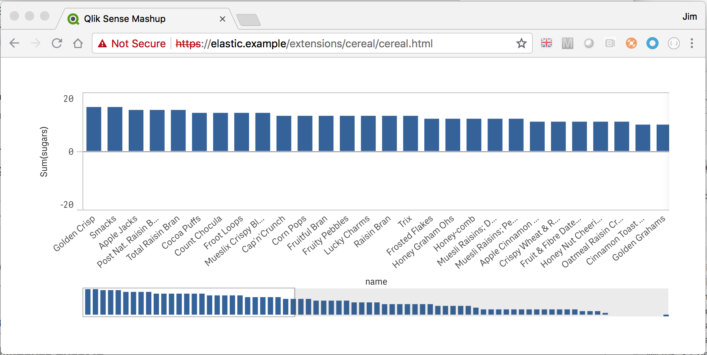

# qlik-mashup
Deploy a simple mashup to QSEfE.  




## Prerequisites
- install QSEfE
- install Elastic Distributor Tester (or QSEfW)
- clone this repo

## Steps

#### 1. Distribute your App
Use Elastic Distributor Tester or QSEfW to distribute your app to QSEfE (e.g., cereal.qvf).

#### 2. Install the chart
```
$ helm install --name qlik-mashup ./chart/qlik-mashup
```
#### 3. Open the mashup
> browse to https://elastic.example/extensions/cereal/cereal.html


## Update the mashup
Here are the steps to update the mashup.

#### 1. Update the mashup in the src folder
Replace the mashup files in ./src with your mashup files and distribute your mashup app to QSEfE (see App Requirements below).

#### 2. Build the docker image locally
The mashup files are bundled in a caddy server in the docker image.  
```
docker build --tag qlik-mashup .
```

#### 3. Change the helm chart values file to point to your local docker image
Change ./chart/qlik-mashup/values.yaml to point to the docker image you just built.  

From:
```yaml
repository: jimareed/qlik-mashup
```

To:
```yaml
repository: qlik-mashup
```

The values.yaml and templates/ingress.yaml files defines an ingress which exposes the extensions folder to the cluster and adds the hooks to authenticate to QSEfE.

Referring to a locally built image works if you are using Kubernetes with Docker for Mac but it may not work for Minicube or cloud based kubernetes clusters.  If you have trouble using a local image, then add the image to a docker registry that your Kubernetes cluster has access to.

#### 4. Update helm chart values to point to your target qsefe helm release name

From:

```yaml
ingress:
  targetAuthReleaseName: qsefe
```

To:

```yaml
ingress:
  targetAuthReleaseName: my-qsefe-release
```

#### 5. Upgrade/install the chart in the same namespace as qsefe
```
helm upgrade qlik-mashup ./chart/qlik-mashup
```
#### 6. Open the mashup

You should be able to open the mashup after making these changes.
> browse to https://elastic.example/extensions/{mashup}/{mashup}.html

## App Requirements
In order to distribute an app to QSEfE, it must contain access control custom properties (e.g., groupswithaccess or userswithaccess) and it must be published.

